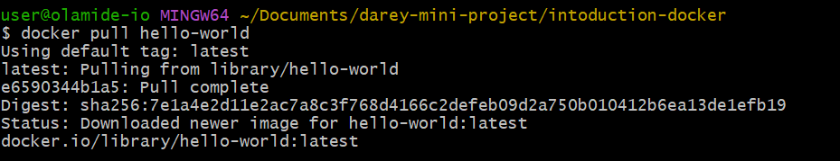
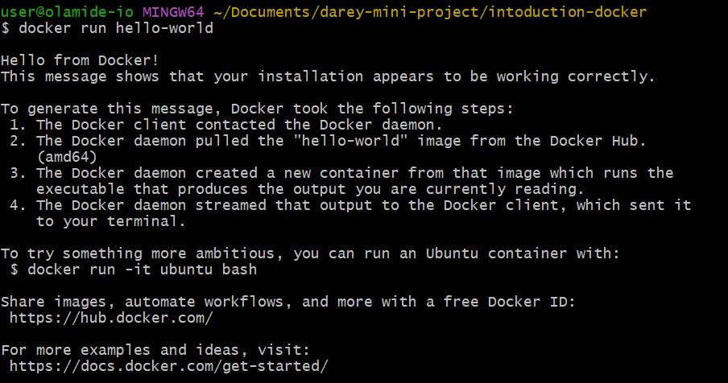
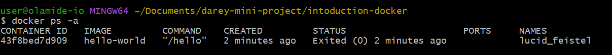
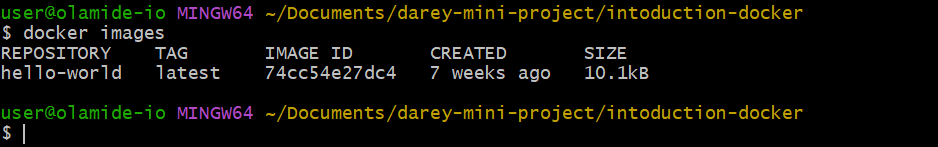

The **docker pull** command downloads a docker image from the docker hub to my local machine as shown below:

The **docker run** command to create and starts the container based on the specified image as shown below:

The **docker ps -a** command to display the list of running containers including those that have stopped

The **docker images** command to list all locally available images:
